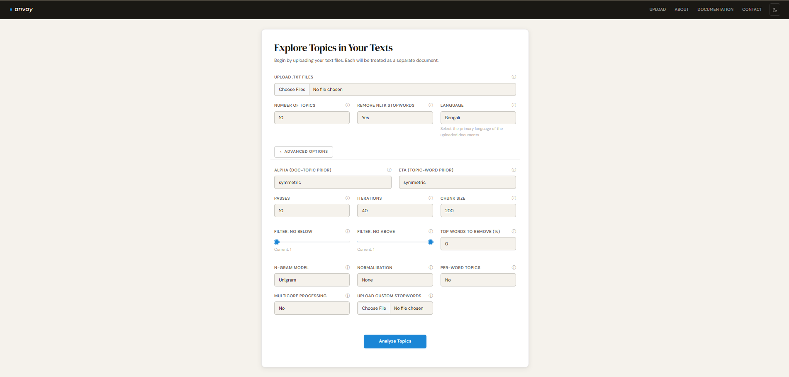
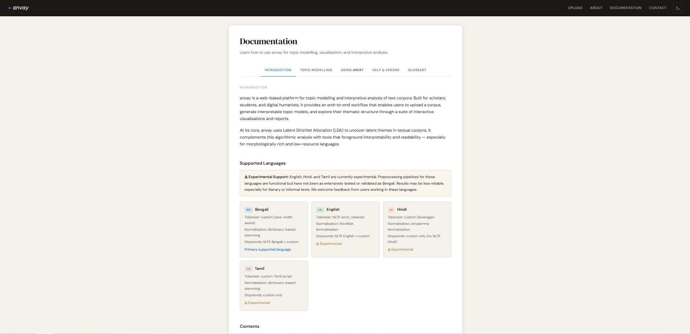
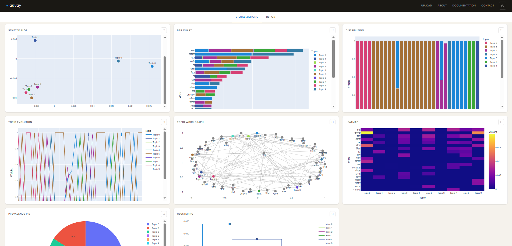
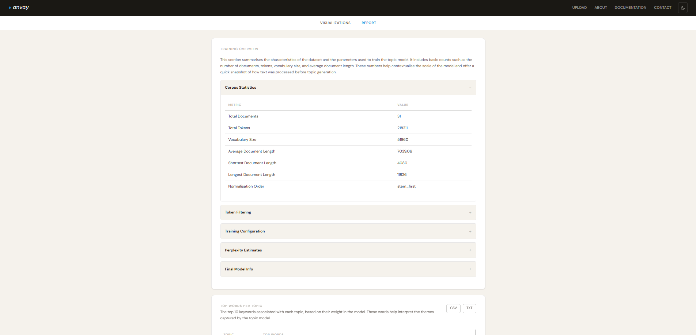

# anvay

**anvay** is a web-based tool for interpretive topic modelling of text corpora. Built for digital humanities research, literary analysis, and linguistic inquiry, it offers fine-grained control over preprocessing and presents results through an interactive interface designed for researchers and students. The application is modular, interpretable, and lightweight, with no reliance on neural networks, transformer embeddings, or LLMs — every transformation is documented and controlled by the user.

anvay takes plain-text `.txt` files, performs preprocessing (tokenisation, normalisation, stopword removal, frequency filtering, n-gram construction), builds a Latent Dirichlet Allocation (LDA) topic model using Gensim, and presents results through visualisations and a structured interpretive report.

---

https://github.com/user-attachments/assets/75327a2f-27fb-467a-8ebf-e1585a97e0ec

---

## Language Support

Bengali is the primary and most thoroughly validated language in anvay. English, Hindi, and Tamil are supported but should be considered **experimental** — functional pipelines, less extensively tested.

| Language | Script | Tokeniser | Normalisation | Status |
|---|---|---|---|---|
| Bengali | Bengali script | Custom (zero-width aware) | Dictionary-based stemming (~75,000 pairs) | Primary |
| English | Latin | NLTK word_tokenize | WordNet lemmatisation | Experimental |
| Hindi | Devanagari | Custom Devanagari | simplemma lemmatisation | Experimental |
| Tamil | Tamil script | Custom Tamil | Dictionary-based stemming | Experimental |

All language pipelines are modular and isolated, so future refinements to experimental languages do not affect the core Bengali pipeline.

---

## Features

### Preprocessing
- Upload up to 800 UTF-8 encoded `.txt` files (max 100 MB total)
- Tokenisation and normalisation tailored to each supported language
- Standard NLTK stopword lists (Bengali and English) plus custom stopword upload
- Configurable stemming and filtering order: **Stem → Filter** or **Filter → Stem**
- `no_below` and `no_above` frequency thresholds
- Top-N% most frequent token removal
- N-gram selection: unigrams, bigrams, trigrams

### Topic Modelling
- Gensim `LdaMulticore` with tunable parameters: number of topics, passes, iterations, alpha, eta, chunk size, minimum probability threshold
- Multicore processing option for large corpora

### Visualisations
- Topic similarity scatterplot (PCA)
- Topic × word heatmap
- Top word frequency bar chart
- Topic prevalence pie chart
- Topic–word network graph
- Topic evolution across documents
- Topic distribution across documents
- Hierarchical clustering dendrogram with merged-cluster keyword tooltips
- Consistent global colour scheme across all charts (golden-ratio hue jumping)
- Top-word hover tooltips on all visualisations

### Report
- Training overview: corpus statistics, token filtering log, perplexity estimates
- Top words per topic (downloadable as CSV and TXT)
- Topic weight matrix per document (downloadable as CSV and TXT)
- Top terms in corpus
- Topic prevalence table
- Representative sentences per topic with ±2 sentence context window and confidence indicator

### Documentation
- Fully integrated documentation panel covering corpus preparation, parameter guidance, visualisation explanations, and a complete walkthrough using a sample Bengali news corpus

---

## What's New in v2.0

### Multilingual expansion
Added experimental support for English, Hindi, and Tamil. Each language has an isolated preprocessing pipeline with language-appropriate tokenisation and normalisation. See [Language Support](#language-support) above.

### Expanded Bengali stemming dictionary
The Bengali stemming dictionary has grown from approximately 7,000 to over 75,000 word pairs. This significantly improves coverage of inflectional and derivational variants, producing more stable and interpretable topic-word distributions — particularly for journalistic and literary corpora.

### Configurable normalisation order
Users can now choose between **Stem → Filter** and **Filter → Stem** preprocessing orders. This makes the preprocessing pipeline transparent and reproducible, and enables comparative experimentation with token reduction strategies.

### Enhanced representative sentence display
Each topic now shows its most representative sentence with two sentences of context on either side, alongside the topic weight. This situates topic salience within local textual context rather than presenting isolated extracts.

---

## Screenshots

<details open>
  <summary>Upload interface</summary>
  
</details>

<details open>
  <summary>Documentation panel</summary>
  
</details>

<details open>
  <summary>Visualisations</summary>
  
</details>

<details open>
  <summary>Report</summary>
  
</details>

---

## Technical Stack

- **Backend**: Python (Flask), Gensim, NLTK, simplemma, NetworkX, Scikit-learn
- **Frontend**: Bootstrap, Plotly, Bokeh, Seaborn
- **Deployment**: Gunicorn on a university or personal server; Docker supported

---

## Installation

anvay has been tested with Python 3.9–3.11 and Gensim 4.3.x.

### Option 1: Virtual environment

```bash
git clone https://github.com/vinayakdasgupta/anvay.git
cd anvay

python -m venv venv
source venv/bin/activate      # macOS/Linux
venv\Scripts\activate         # Windows

pip install -r requirements.txt
python app.py
```

Open `http://localhost:5000` in your browser.

### Option 2: Docker

```bash
git clone https://github.com/vinayakdasgupta/anvay.git
cd anvay

docker build -t anvay .
docker run -p 5000:5000 anvay
```

Open `http://localhost:5000` in your browser.

---

## Citation

If you use anvay in academic work, please cite:

> Das Gupta, V., (2026). anvay: A Web-based Tool for Interpretive Topic Modelling in Bengali. *Journal of Open Source Software*, 11(118), 8641, https://doi.org/10.21105/joss.08641

```bibtex
@article{Das Gupta2026,
  doi       = {10.21105/joss.08641},
  url       = {https://doi.org/10.21105/joss.08641},
  year      = {2026},
  publisher = {The Open Journal},
  volume    = {11},
  number    = {118},
  pages     = {8641},
  author    = {Das Gupta, Vinayak},
  title     = {anvay: A Web-based Tool for Interpretive Topic Modelling in Bengali},
  journal   = {Journal of Open Source Software}
}
```

---

## Referenced Libraries and Datasets

### Bengali lemmatisation dataset

```bibtex
@inproceedings{chakrabarty-etal-2017-context,
  title     = {Context Sensitive Lemmatization Using Two Successive Bidirectional Gated Recurrent Networks},
  author    = {Chakrabarty, Abhisek and Pandit, Onkar Arun and Garain, Utpal},
  booktitle = {Proceedings of the 55th Annual Meeting of the Association for Computational Linguistics},
  pages     = {1481--1491},
  year      = {2017},
  publisher = {Association for Computational Linguistics},
  doi       = {10.18653/v1/P17-1136}
}

@article{alam2021review,
  title   = {A Review of Bangla Natural Language Processing Tasks and the Utility of Transformer Models},
  author  = {Alam, Firoj and Hasan, Md Arid and Alam, Tanvir and Khan, Akib and Tajrin, Janntatul and Khan, Naira and Chowdhury, Shammur Absar},
  journal = {arXiv preprint arXiv:2107.03844},
  year    = {2021}
}

@article{islam2025banglalem,
  title     = {BanglaLem: A Transformer-based Bangla Lemmatizer with an Enhanced Dataset},
  author    = {Islam, Md Fuadul and Hasan, Jakir and Islam, Md Ashikul and Dewan, Prato and Rahman, M Shahidur},
  journal   = {Systems and Soft Computing},
  pages     = {200244},
  year      = {2025},
  publisher = {Elsevier}
}
```

### Gensim

```bibtex
@inproceedings{rehurek_lrec,
  author    = {Řehůřek, Radim and Sojka, Petr},
  title     = {Software Framework for Topic Modelling with Large Corpora},
  booktitle = {Proceedings of the LREC 2010 Workshop on New Challenges for NLP Frameworks},
  pages     = {45--50},
  year      = {2010},
  publisher = {ELRA}
}
```

### NLTK

```bibtex
@book{bird2009natural,
  author    = {Bird, Steven and Klein, Ewan and Loper, Edward},
  title     = {Natural Language Processing with Python},
  year      = {2009},
  publisher = {O'Reilly Media}
}
```

### NetworkX

```bibtex
@inproceedings{hagberg2008exploring,
  author    = {Hagberg, Aric A. and Schult, Daniel A. and Swart, Pieter J.},
  title     = {Exploring Network Structure, Dynamics, and Function using NetworkX},
  booktitle = {Proceedings of the 7th Python in Science Conference},
  pages     = {11--15},
  year      = {2008}
}
```

### Scikit-learn

```bibtex
@article{pedregosa2011scikit,
  author  = {Pedregosa, Fabian et al.},
  title   = {Scikit-learn: Machine Learning in Python},
  journal = {Journal of Machine Learning Research},
  volume  = {12},
  pages   = {2825--2830},
  year    = {2011}
}
```

### Plotly

> Plotly Technologies Inc. (2015). *Collaborative data science*. Montreal, QC. https://plot.ly

---

## Acknowledgements

anvay draws on Gensim (topic modelling), NLTK (tokenisation and stopwords), simplemma (Hindi lemmatisation), Plotly, Seaborn, and Matplotlib (visualisation), NetworkX (topic-word graph), Scikit-learn (PCA and clustering), and Flask (web framework).

---

## Licence

MIT Licence

---

## Contact

Vinayak Das Gupta — Shiv Nadar University  
https://vinayakdasgupta.com  
For questions, suggestions, or collaborations, please open an issue on GitHub.