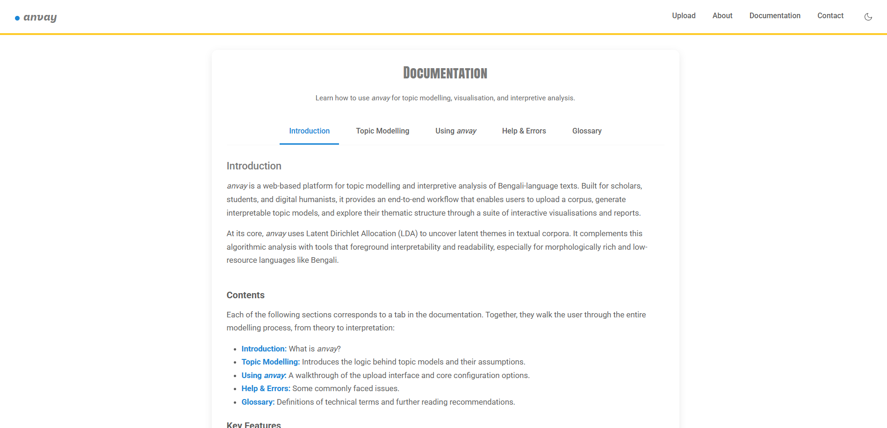
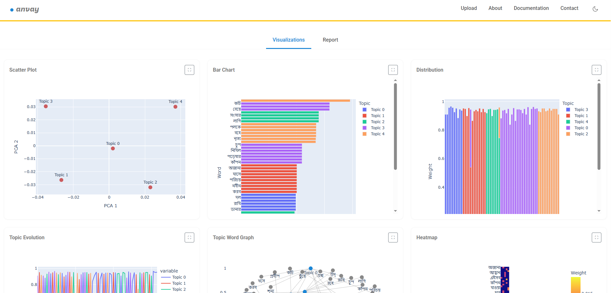

# anvay: A Bengali Topic Modelling Dashboard

<details open>
  <summary>Anvay demo video</summary>

  

</details>

**anvay** is a web-based topic modelling interface built for exploring, analysing, and interpreting large corpora of Bengali text. Developed with a focus on literary and historical materials, anvay offers users fine-grained control over preprocessing options and presents results in a structured, interactive interface designed for both researchers and students. The application is modular, interpretable, and lightweight, making it suitable for public deployment and pedagogical use.

## Overview

anvay takes plain-text `.txt` files in Bengali, performs preprocessing (tokenisation, stemming, stopword removal, frequency filtering, n-gram construction), builds a Latent Dirichlet Allocation (LDA) topic model using Gensim, and visualises the results across multiple tabs with topic-wise document insights.

The interface is designed to foreground interpretability over complexity: there is no reliance on neural networks, transformer embeddings, or LLMs. Every transformation is documented and controlled by the user.

---

## Features

### Upload & Preprocessing
- Upload up to **800 UTF-8 encoded .txt files** at once (maximum total size: 100MB)
- Corpus size and token thresholds enforced to ensure browser responsiveness
- Preprocessing controls include:
  - Standard + custom Bengali stopwords
  - `no_below` and `no_above` frequency thresholds
  - Top-N% most frequent tokens filter
  - N-gram selection: unigrams, bigrams, trigrams
  - Dictionary-based stemming

### Dictionary-Based Stemming (v1.1.0)
- Replaces earlier rule-based suffix stripping
- Offers better semantic interpretability and topic-word clarity

### Topic Modelling
- Gensim's `LdaMulticore` implementation for fast, multicore topic modelling
- Tunable parameters:
  - Number of topics
  - Passes and iterations
  - Alpha and Eta priors
  - Chunk size
  - Minimum probability threshold


### Visualisations (Tabbed UI)
- **Visualisations Tab**: Bar chart, scatter plot, pie chart, heatmap, topic-word network graph
- **Report Tab**: Training summary, top tokens, topic prevalence, representative documents
- **Downloads Tab**: Export results as CSV and TXT
- **Guide Tab**: Step-by-step interpretive instructions

### Topic-Document Drilldown
- Per-topic list of most representative documents
- Context-aware sentence preview
- Topic label and confidence indicator

### Design Principles
- Mobile-friendly and responsive layout

---

## Documentation


anvay includes a fully integrated documentation panel accessible from the interface itself. The documentation is designed not merely as technical reference, but as a pedagogical aid that walks users through each stage of the topic modelling process — from corpus preparation and parameter selection to result interpretation. It explains preprocessing choices (e.g. stopword filtering, n-gram selection, stemming) in clear language, and provides visual examples and tooltips to guide first-time users. The documentation also includes a walkthrough of a sample run, highlighting what users can expect from the model outputs. Importantly, the documentation assumes no prior knowledge of machine learning, making anvay accessible to students, scholars, and corpus curators working with Bengali texts.

---

## Screenshots

<details open>
  <summary>Upload interface screenshot</summary>
  
</details>

<details open>
  <summary>Documentation interface screenshot</summary>
  
</details>

<details open>
  <summary>Visualization interface screenshot</summary>
  
</details>

<details open>
  <summary>Report interface screenshot</summary>
  
</details>


---

## Technical Stack

- **Backend**: Python (Flask), Gensim, NLTK, NetworkX, Scikit-learn
- **Frontend**: Bootstrap, jQuery, Plotly, Bokeh, Seaborn
- **Deployment**: Designed to be hosted on a university or personal server (e.g., via Gunicorn)

---

## Installation
anvay has been tested with Python 3.9 and Gensim 4.3.3. Compatibility with other versions may vary.

### Prerequisites
- Python 3.9 or higher
- Git
- pip (Python package installer)

### Step-by-Step Instructions

1. **Clone the Repository**
```bash
git clone https://github.com/vinayakdasgupta/anvay.git
```
```bash
cd anvay
```

2. **(Recommended) Create a Virtual Environment**
```bash
python -m venv venv
source venv/bin/activate  # On Windows use: venv\Scripts\activate
```

3. **Install Dependencies**
```bash
pip install -r requirements.txt
```

4. **Run the Application**
```bash
python app.py
```

5. **Access the Web Interface**

Open your browser and navigate to:
```
http://localhost:5000
```

You can now upload your `.txt` files and begin exploring topics.

---

## How to Cite anvay

If you use anvay in academic work, please cite it as follows:

> Vinayak Das Gupta. *anvay: A Bengali Topic Modelling Dashboard*. v1.1.0, 2025. GitHub repository: https://github.com/vinayakdasgupta/anvay (accessed [date]).

Once a DOI or formal publication is available, this should be replaced with the appropriate citation.

---

## Referenced Datasets and Libraries

The following tools, datasets, and libraries are used in anvay and should be cited as appropriate:

### Lemmatization Dataset
```bibtex
@inproceedings{chakrabarty-etal-2017-context,
    title = "Context Sensitive Lemmatization Using Two Successive Bidirectional Gated Recurrent Networks",
    author = "Chakrabarty, Abhisek  and
      Pandit, Onkar Arun  and
      Garain, Utpal",
    editor = "Barzilay, Regina  and
      Kan, Min-Yen",
    booktitle = "Proceedings of the 55th Annual Meeting of the Association for Computational Linguistics (Volume 1: Long Papers)",
    month = jul,
    year = "2017",
    address = "Vancouver, Canada",
    publisher = "Association for Computational Linguistics",
    url = "https://aclanthology.org/P17-1136/",
    doi = "10.18653/v1/P17-1136",
    pages = "1481--1491"
}

@article{alam2021review,
  title={A Review of Bangla Natural Language Processing Tasks and the Utility of Transformer Models},
  author={Alam, Firoj and Hasan, Md Arid and Alam, Tanvir and Khan, Akib and Tajrin, Janntatul and Khan, Naira and Chowdhury, Shammur Absar},
  journal={arXiv preprint arXiv:2107.03844},
  year={2021}
}
```

### Gensim
```bibtex
@inproceedings{rehurek_lrec,
  author = {Řehůřek, Radim and Sojka, Petr},
  title = {Software Framework for Topic Modelling with Large Corpora},
  booktitle = {Proceedings of the LREC 2010 Workshop on New Challenges for NLP Frameworks},
  pages = {45--50},
  year = {2010},
  publisher = {ELRA},
  address = {Valletta, Malta},
}
```

### NLTK
```bibtex
@book{bird2009natural,
  author = {Bird, Steven and Klein, Ewan and Loper, Edward},
  title = {Natural Language Processing with Python},
  year = {2009},
  publisher = {O'Reilly Media, Inc.}
}
```

### NetworkX
```bibtex
@inproceedings{hagberg2008exploring,
  author = {Hagberg, Aric A. and Schult, Daniel A. and Swart, Pieter J.},
  title = {Exploring Network Structure, Dynamics, and Function using NetworkX},
  booktitle = {Proceedings of the 7th Python in Science Conference (SciPy2008)},
  pages = {11--15},
  year = {2008}
}
```

### Scikit-learn
```bibtex
@article{pedregosa2011scikit,
  author = {Pedregosa, Fabian et al.},
  title = {Scikit-learn: Machine Learning in Python},
  journal = {Journal of Machine Learning Research},
  volume = {12},
  pages = {2825--2830},
  year = {2011}
}
```

### Plotly
> Plotly Technologies Inc. (2015). *Collaborative data science*. Montreal, QC. https://plot.ly

---

## Acknowledgements

anvay draws on multiple open-source projects:
- **Gensim** – topic modelling
- **NLTK** – stopword filtering
- **Plotly, Seaborn, Matplotlib** – visualisation
- **NetworkX** – topic-word graph
- **Scikit-learn** – PCA and clustering
- **Flask** – web application framework

---

## License

anvay is released under the MIT License. 

---

## Contact

Vinayak Das Gupta  
Shiv Nadar University
[https://vinayakdasgupta.com]

For questions, suggestions, or scholarly collaborations, please open an issue or contact via GitHub.

